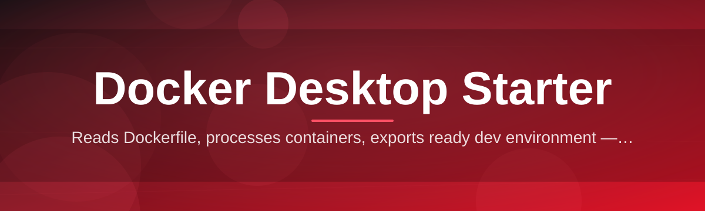
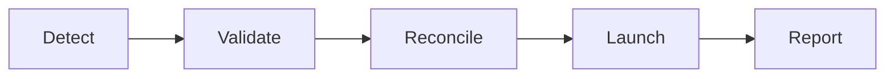

# docker-desktop-starter-companion 🐳⚙️

  

*The little companion app that gets your Docker Desktop environment sane before you even open a terminal.*

  

## 🚫 What This Is NOT

Let's clear the air, because I'm tired of README-skimming and disappointment.

This is **not** a Docker Desktop replacement, a fork, a "lite" clone, or some background daemon that phones home. It's not a GUI wrapper trying to reinvent `docker ps` with worse fonts. And it's definitely not another Electron blob that eats 400MB of RAM just to show you a container list you could've gotten from the CLI in half a second.

What it **is**: a small, standalone Windows companion that sits next to Docker Desktop and handles the tedious pre-flight checklist — WSL2 backend sanity, resource limits, context switching, config drift — the stuff nobody wants to babysit every time they reboot their machine. Think of it as the co-pilot that checks the fuel gauge before you take off, not the plane itself.

---

## 🧭 Overview

Docker Desktop is great. Docker Desktop's *default onboarding experience* is not. Anyone who's spent an afternoon debugging why WSL2 silently ate 12GB of RAM, or why their bind mounts vanished after a Windows update, knows the gap this project fills. `docker-desktop-starter-companion` exists because "just restart Docker Desktop" got old fast, and because good developer tooling shouldn't require a PhD in Hyper-V networking.

This tool was built for the Windows developer who runs containers daily — backend engineers, DevOps folks, students learning Docker for the first time — and who wants a fast, opinionated launch sequence instead of clicking through settings menus hoping something sticks. It's not magic. It's just automation applied to the boring parts, wrapped in a UI that doesn't insult your intelligence.

If you've ever muttered "why is this not just a button" while staring at Docker Desktop's settings panel, this is the button.

---

## 🔥 What It Actually Does

> [!NOTE]
> Everything below runs locally on your machine. No telemetry, no cloud round-trips, no mystery background processes phoning home at 3am.

- **Pre-flight environment check** — validates WSL2 status, virtualization flags, and Docker Desktop's daemon state before you try to run a single container, so you're not debugging blind.

- **One-click launch sequencing** — starts Docker Desktop in the right order with the right wait conditions, instead of you mashing the icon three times because "it didn't open."

- **Resource profile switching** — jump between "laptop battery mode" and "I'm building a monorepo" CPU/memory presets without digging through nested settings screens.

- **Context-aware shortcuts** — surfaces the Docker contexts, compose projects, and volumes you actually use, not a wall of every container you spun up in 2023.

- **Config drift detection** — flags when your `daemon.json` or WSL config quietly changed (Windows updates love doing this) and offers a one-step restore.

- **Startup diagnostics log** — a clean, readable log of exactly what happened during boot, so "it's broken" becomes "oh, port 2375 is taken."

- **Lightweight tray presence** — sits quietly in your system tray, does nothing until you ask it to, unlike some tools we won't name.

---

## 🚀 How To Get Started

1. **Visit the landing page** using the download button above — that's the only official source, bookmark it.

2. **Download the companion package** for Windows. No installer wizard with six "next" buttons and a surprise toolbar offer.

3. **Run the executable.** It's standalone — no dependency chain, no runtime you need to install first.

4. **Launch Docker Desktop through the companion** (or let it detect an already-running instance) and let the pre-flight checks do their thing.

> [!TIP]
> First run takes an extra few seconds while it profiles your system. Every run after that is near-instant because it caches what it learned.

---

## 🖥️ System Requirements

| Requirement | Detail |
|---|---|
| OS | Windows 10 (21H2+) or Windows 11 |
| Architecture | x64 |
| Dependencies | None — fully standalone |
| Docker Desktop | Installed separately (this is a companion, not a replacement) |
| Disk space | Under 50MB |
| Admin rights | Only needed for WSL2 diagnostics, not for normal use |

  

---

## 🏗️ How It Works

The architecture is deliberately boring, and that's the point. Boring is reliable. Here's the flow, top to bottom:

1. **Detect** — the companion scans for Docker Desktop's installation path, WSL2 distro state, and current daemon status.

2. **Validate** — it cross-checks resource allocation, config files, and network settings against known-good baselines.

3. **Reconcile** — any drift or misconfiguration gets flagged, and where it's safe to auto-fix (like a stale context pointer), it does.

4. **Launch** — Docker Desktop is started (or resumed) in the correct sequence, waiting on real readiness signals instead of arbitrary timers.

5. **Report** — a clean summary lands in the log panel so you know exactly what happened, not just "success" or a spinning wheel of despair.

> [!IMPORTANT]
> The companion never modifies Docker Desktop's core binaries or Docker Engine internals. It only orchestrates config and launch timing — think traffic controller, not surgeon.

---

## 🧩 Troubleshooting

<strong>The companion says Docker Desktop isn't detected, but it's clearly installed.</strong>

This usually means Docker Desktop was installed to a non-default path, or a previous uninstall left registry crumbs behind. Re-running the companion after a fresh Docker Desktop launch usually re-syncs detection.

<strong>WSL2 status shows "unknown" instead of running/stopped.</strong>

That's typically a permissions issue — WSL2 diagnostics need elevated access to read certain kernel state. Try running once with admin rights, then normal runs work fine afterward.

<strong>My resource profile reverted after a Windows update.</strong>

Yep, Windows updates love touching WSL config files. That's exactly the drift the companion is built to catch — it should flag this automatically on next launch and offer to restore your saved profile.

<strong>The tray icon disappeared.</strong>

Windows sometimes hides tray icons in the overflow menu after updates. Check there first before assuming something crashed — nine times out of ten it's just Windows being Windows.

<strong>Launch sequencing feels slower than just opening Docker Desktop manually.</strong>

The first run does a full system profile, which takes longer by design — it's building the baseline it'll use to catch drift later. Every subsequent launch should be noticeably faster.

---

## 🎨 UI / UX Details

- **Themes** — Light, Dark, and a "System" mode that actually respects your Windows accent color instead of ignoring it like some apps do.

- **Keyboard shortcuts:**

| Shortcut | Action |
|---|---|
| `Ctrl+L` | Trigger launch sequence |
| `Ctrl+R` | Re-run diagnostics |
| `Ctrl+,` | Open settings |
| `Ctrl+Shift+L` | Open startup log |
| `Esc` | Minimize to tray |

- **Settings panel** — persists your resource profile, theme, and startup behavior across updates. No re-configuring every time you download a new version.

> [!WARNING]
> Disabling the pre-flight checks entirely (yes, there's a toggle) is technically supported but not recommended unless you *really* know what you're doing and enjoy debugging blind later.

---

## 🤝 Contributing & Community

This project grew from a personal annoyance into something a lot of people apparently share — which is either validating or mildly concerning, depending on your outlook on Windows containerization tooling.

- Found a bug? Open an issue with your OS build and Docker Desktop version — vague reports get vague answers.
- Have an idea? PRs are welcome, but architecture-changing ones should start as a discussion first, please.
- Want to help without writing code? Improving the troubleshooting docs is genuinely just as valuable.

> [!TIP]
> Star the repo if this saved you a Saturday morning. It's free, it takes two seconds, and it genuinely helps visibility.

---

## 📜 License

Released under the [MIT License](LICENSE), 2026. Use it, fork it, build on it — just don't rebrand it and sell it as your own totally-original idea.

---

## ⚠️ Disclaimer

This is an independent, community-built companion tool and is **not affiliated with, endorsed by, or officially connected to Docker, Inc.** Docker Desktop and the Docker logo are trademarks of their respective owner. Use this software at your own discretion — the maintainers aren't liable for lost containers, misplaced volumes, or existential crises caused by WSL2 networking.

